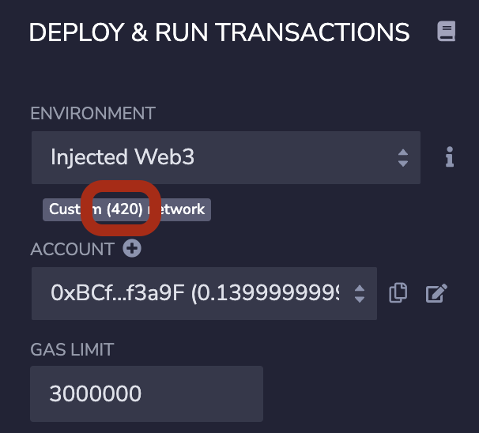
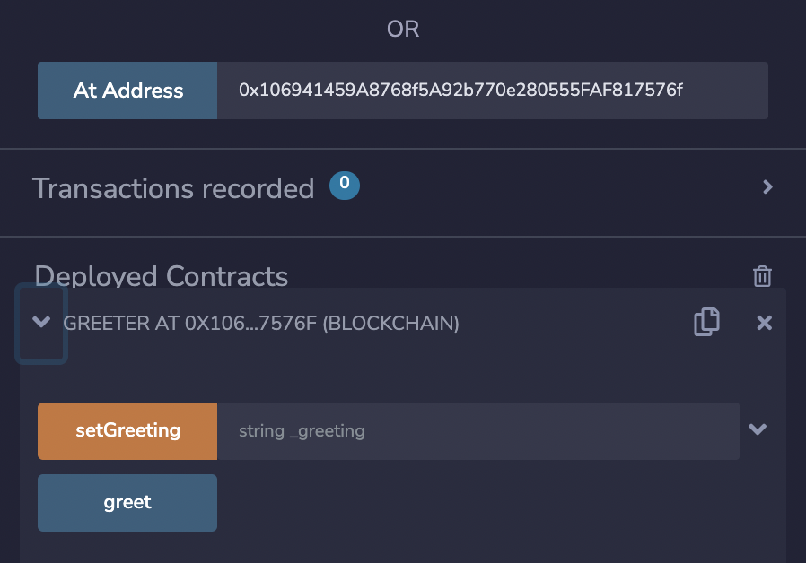
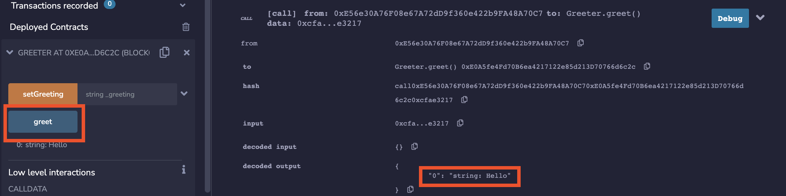
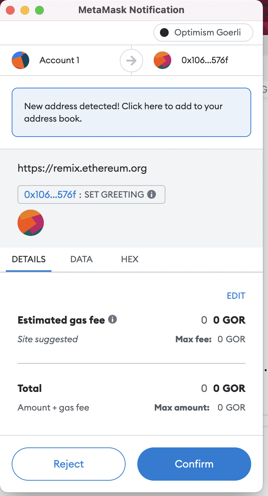
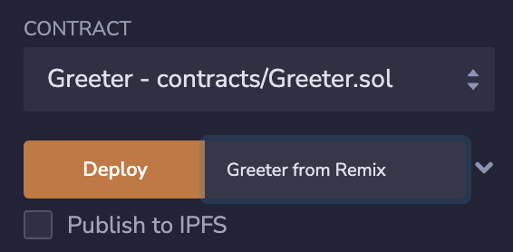

# Getting started developing for BL Mainnet
[](https://twitter.com/SafeBlastArmy)

This tutorial teaches you the basics of BL Mainnet development.
BL Mainnet is [EVM equivalent](https://medium.com/ethereum-optimism/introducing-evm-equivalence-5c2021deb306), meaning we run a slightly modified version of the same `geth` you run on mainnet.
Therefore, the differences between BL Mainnet development and Ethereum development are minor.
But a few differences [do exist](https://community.optimism.io/docs/developers/build/differences/#).


## BL Mainnet and BL Goerli Endpoint URLs

To access the BL Mainnet and BL Goerli networks, you can use the following endpoint URLs directly:

- Mainnet: `https://rpc.blastblockchain.com`
- Goerli Testnet: `https://testnet-rpc.blastblockchain.com`

### Network choice

For development purposes we recommend you use either a local development node or [Blast Goerli](https://goerli-explorer.blastblockchain.com/).
That way you don't need to spend real money.
If you need ETH on BL Goerli for testing purposes, [you can use this faucet](https://blastblockchain.com).

## Interacting with contracts on BL Mainnet or BL Goerli

We have [Hardhat's Greeter contract](hardhat/contracts/Greeter.sol) on BL Goerli, at address [0x00000000000000000000000000000000000000000](https://goerli-explorer.blastblockchain.com/address/0x00000000000000000000000000000000000000000). 
You can verify your development stack configuration by interacting with it. 

As you can see in the different development stacks below, the way you deploy contracts and interact with them on BL Mainnet or BL Goerli is almost identical to the way you do it with L1 Ethereum.
The most visible difference is that you have to specify a different endpoint (of course). 
The list of other differences is [here](https://community.optimism.io/docs/developers/build/differences/).

## Development stacks

- [Apeworx](#apeworx)
- [Brownie](#brownie)
- [Foundry](#foundry)
- [Hardhat](#hardhat)
- [Remix](#remix)
- [Truffle](#truffle)
- [Waffle](#waffle)

### Hardhat

In [Hardhat](https://hardhat.org/) you use a configuration similar to [this one](https://github.com/BLASTchain/blast-tutorial/tree/main/getting-started/hardhat).

#### Connecting to BL Goerli

Follow these steps to add BL Goerli support to an existing Hardhat project (or a newly created one). 


1. Define your network configuration in `.env`:

   ```sh
   # Put the mnemonic for an account on BL Goerli here
   MNEMONIC=test test test test test test test test test test test junk

   # URL to access BL Goerli
   BLAST_GOERLI_URL=
   ```

1. Add `dotenv` to your project:

   ```sh
   yarn add dotenv
   ```

1. Edit `hardhat.config.js`:

   1. Use `.env` for your blockchain configuration:

      ```js
      require('dotenv').config()
      ```

   1. Get the correct URL from the configuration:

      ```js
      const blastGoerliUrl = process.env.BLAST_GOERLI_URL
      ```


   1. Add a network definition in `module.exports.networks`:

   ```js
   "blast-goerli": {
      url: blastGoerliUrl,
      accounts: { mnemonic: process.env.MNEMONIC }
   }   
   ```


#### Greeter interaction

1. Run the console:
   ```sh
   cd hardhat
   yarn
   yarn hardhat console --network blast-goerli
   ```

1. Connect to the Greeter contract:   

   ```js
   Greeter = await ethers.getContractFactory("Greeter")
   greeter = await Greeter.attach("0x00000000000000000000000000000000000000000")
   ```   


1. Read information from the contract:

   ```js
   await greeter.greet()
   ```

1. Submit a transaction, wait for it to be processed, and see that it affected the state.

   ```js
   tx = await greeter.setGreeting(`Hardhat: Hello ${new Date()}`)
   rcpt = await tx.wait()  
   await greeter.greet()
   ```

#### Deploying a contract

To deploy a contract from the Hardhat console:

```
Greeter = await ethers.getContractFactory("Greeter")
greeter = await Greeter.deploy("Greeter from hardhat")
console.log(`Contract address: ${greeter.address}`)
await greeter.greet()
```

### Truffle

In [Truffle](https://trufflesuite.com/) you use a configuration similar to [this one](https://github.com/BLASTchain/blast-tutorial/tree/main/getting-started/truffle).

#### Connecting to BL Goerli

Follow these steps to add BL Goerli support to an existing Truffle project. 


1. Define your network configuration in `.env`:

   ```sh
   # Put the mnemonic for an account on BL Goerli here
   MNEMONIC=test test test test test test test test test test test junk

   # URL to access BL Goerli
   BLAST_GOERLI_URL=
   ```

1. Add `dotenv` and `@truffle/hdwallet-provider` to your project:

   ```sh
   yarn add dotenv @truffle/hdwallet-provider
   ```


1. Edit `truffle-config.js`:

   1. Uncomment this line:

      ```js
      const HDWalletProvider = require('@truffle/hdwallet-provider')
      ```

   1. Use `.env` for your network configuration:

      ```js
      require('dotenv').config()
      ```

   1. Get the correct URL:

      ```js
      const blastGoerliUrl = process.env.BLAST_GOERLI_URL
      ```

   1. Add a network definition in `module.exports.networks`:

      ```js
      "blast-goerli": {
         provider: () => new HDWalletProvider(
            process.env.MNEMONIC,
            blastGoerliUrl),
         network_id: 239
      }
      ```


#### Greeter interaction

1. Compile the contract and run the console.

   ```sh
   truffle compile
   truffle console --network optimism-goerli
   ```

1. Connect to the Greeter contact.

   ```js
   greeter = await Greeter.at("0x575E9B4f2c3945d7CF07cb76628d29DF471692B8")
   ```

1. Read information from the contact.

   ```js
   await greeter.greet()
   ```

1. Submit a transaction.

   ```js
   tx = await greeter.setGreeting(`Truffle: Hello ${new Date()}`)
   ```

1. Wait a few seconds for the transaction to be processed.s

1. See that the greeting has changed.

   ```js
   greeter.greet()
   ```


#### Contract deployment

You deploy a new contract from the console.

``` 
greeter = await Greeter.new("Greeter from Truffle")
```

Wait a few seconds for the deployment to actually happen and then verify.

```
console.log(`Contract address: ${greeter.address}`)
await greeter.greet()
```


### Remix

#### Connecting to BL Goerli

In [Remix](https://remix.ethereum.org) you access BL Goerli (or BL Mainnet) through your own wallet.

1. Add BL Goerli to your wallet. 
   The easiest way to do this is to use [chainid.link](https://chainid.link/?network=optimism-goerli).

1. Log on with your wallet to BL Goerli.

1. Browse to [Remix](https://remix.ethereum.org/).
1. Click the run icon ().
1. Select the Environment **Injected Provider - MetaMask**.
1. Accept the connection in the wallet.

#### Greeter interaction

1. Click the run icon ().

1. Make sure your environment is **Injected Web3** and the network ID is **420**.

   

1. Click the files icon ().

1. Download [Greeter.sol](hardhat/contracts/Greeter.sol) and upload () it to Remix under **contracts**.

1. Right-click **contracts > Greeter.sol** and select **Compile**.

1. Open **contracts > artifacts** and see that there's a `Greeter.json` file. This file is the compiled version, the API for the contract, etc.

1. Click the run icon ().

1. Scroll down. 
   In the At Address field, type the contract address `0x575E9B4f2c3945d7CF07cb76628d29DF471692B8`.
   Then, click **At Address**. 
   Expand the contract to see you can interact with it.

   

1. Click **greet** and expand the transaction result in the console (bottom right).

   

1. Type a greeting (preferably, one that starts with the word `Remix`) and then click **setGreeting**. Approve the transaction in your wallet. 
   Note that if the greeting includes a comma you need to enclose it in quotes.

   

1. See the results on the console and then click **greet** again to see the greeting changed (see it under the **greet** button).


#### Contract deployment

You deploy a new contract:

1. Type a string for the greeter.

1. Click **Deploy**.

   

1. Confirm the transaction in the wallet.


### Foundry

#### Greeter interaction

Foundry does not give us a JavaScript console, everything can be done from the shell command line.

1. Set the RPC URL and the contract address.

   ```sh
   export ETH_RPC_URL= << Your Goerli URL goes here >>
   export GREETER=0x575E9B4f2c3945d7CF07cb76628d29DF471692B8   
   ```

1. Call `greet()`. Notice that the response is provided in hex.

   ```sh
   cast call $GREETER "greet()"
   ```

1. Call `greet()` again, and this time translate to ASCII

   ```sh
   cast call $GREETER "greet()" | cast --to-ascii
   ```

1. Put your mnemonic in a file `mnem.delme` and send a transaction. 

   ```sh
   cast send --mnemonic-path mnem.delme $GREETER "setGreeting(string)" "Foundry hello" --legacy
   ```

1. Test that the greeting has changed:

   ```sh
   cast call $GREETER "greet()" | cast --to-ascii
   ```

#### Contract deployment

Use this command:

```sh
forge create --mnemonic-path ./mnem.delme Greeter \
   --constructor-args "Greeter from Foundry" --legacy
```


#### Using the Blast contract library

This library is provided as an [npm package](https://www.npmjs.com/package/@eth-blast/contracts), which is different from what forge expects.
Here is how you can import it without importing the entire OP-Stack monorepo:

1. Install the JavaScript tools if you don't already have them: [Node.js](https://nodejs.org/en/download/) and [yarn](https://classic.yarnpkg.com/lang/en/).

1. Install the `@eth-blast/contracts` library under `lib`.

   ```sh
   cd lib
   yarn add @eth-blast/contracts
   ```

1. If you are using `git`, add `node_modules` to [`.gitignore`](https://git-scm.com/docs/gitignore).

1. The remapping that `forge` deduces is not the same as what you would have with hardhat.
   To ensure source code compatibility, create a file (in the application's root directory) called `remappings.txt` with this content:
 
   ```
   @eth-blast/=lib/node_modules/@eth-blast/
   ```

You can now run `forge build` with contracts that use the Blast contract library.


### Brownie

If you want to develop in Python, you can use the [Brownie](https://eth-brownie.readthedocs.io/en/stable/install.html) toolstack.

#### Greeter interaction

1. Change to the `brownie` directory under `getting-started`.

1. Specify your mnemonic in `.env`:

   ```sh
   # Put the mnemonic for an account on BL Goerli here
   MNEMONIC=test test test test test test test test test test test junk
   ```

1. Install packages.

   ```sh
   pip3 install eth-brownie 
   pip3 install dotenv
   ```

1. Update the `blast-test` network.

   ```sh
   brownie networks modify blast-test chainid=239 \
      explorer=goerli-explorer.blastblockchain.com \
      host= << BL Goerli URL >>
   ```

1. Start the console.

   ```sh
   brownie console --network blast-test
   ```

   Note that the default color scheme assumes a dark background. 
   If your default background is light, you might want to create a file `brownie-config.yaml` with this content:

   ```yaml
   console:
      show_colors: true
      color_style: manni
   ```

1. Read `.env`

   ```python
   import os
   from dotenv import load_dotenv
   load_dotenv()
   ```

1. Add your accounts to the `accounts` list:

   ```python
   from eth_account import Account
   acct = Account.from_mnemonic(os.getenv("MNEMONIC"))
   accounts.add(acct.privateKey)
   ```

1. Create an object for the contract:

   ```python
   greeter = Greeter.at("0x575E9B4f2c3945d7CF07cb76628d29DF471692B8")
   ```

1. View the current greeting:

   ```python
   greeter.greet()
   ```

1. Modify the greeting and see the new one:

   ```python
   greeter.setGreeting("Brownie hello", {'from': accounts[0] })
   greeter.greet()
   ```

#### Contract deployment

Use this command:

```python
Greeter.deploy("Hello", {'from': accounts[0]})
```

## Best practices

It is best to start development with the EVM provided by the development stack. 
Not only is it faster, but such EVMs often have extra features, such as the [ability to log messages from Solidity](https://hardhat.org/tutorial/debugging-with-hardhat-network.html) or a [graphical user interface](https://trufflesuite.com/ganache/).

After you are done with that development, debug your decentralized application using either a [development node](https://community.optimism.io/docs/developers/build/dev-node/) or the [Goerli test network](https://community.optimism.io/docs/useful-tools/networks/). 
This lets you debug parts that are BL Mainnet specific such as calls to bridges to transfer assets between layers.

Only when you have a version that works well on a test network should you deploy to the production network, where every transaction has a cost.

### Contract source verification

You don't have to upload your source code to [block explorers](https://blastblockchain.com/), but it is a good idea. 
On the test network it lets you issue queries and transactions from the explorer's user interface.
On the production network it lets users know exactly what your contract does, which is conducive to trust.

Just remember, if you use [the Blast Explorer API](https://blastblockchain.com/api-docs), you need one API key for BL Mainnet and a separate one for BL Goerli.
